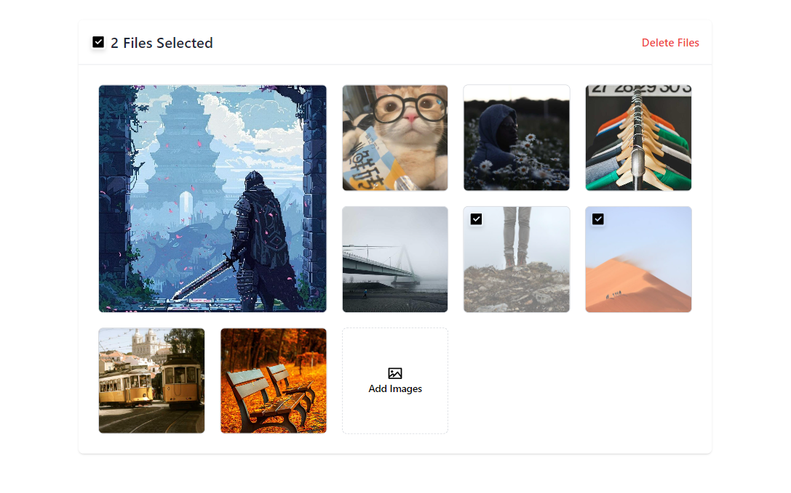

# Image Gallery

This project is an image gallery application that supports uploading images via URLs and local files, with drag-and-drop functionality for rearranging images. It uses React, Tailwind CSS, and `@dnd-kit` for the drag-and-drop feature.

## Demo

You can view a live demo of the project [here](https://ixedasan.github.io/react-image-gallery/)



## Installation

To clone and run this application, you'll need [Git](https://git-scm.com/) and [NPM](https://nodejs.org/en/download/package-manager) installed on your computer. From your command line:

```
# Clone this repository
$ git clone https://github.com/ixedasan/react-image-gallery

# Navigate to the project directory
$ cd react-image-gallery

# Install dependencies
$ npm install

# Start the development server
$ npm run dev
```

## Contributing

Contributions are welcome! Please open an issue or submit a pull request.
